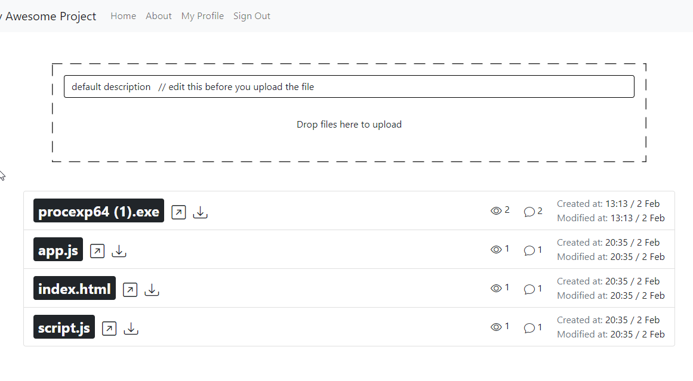

# Labrin Task Project

## User files page

## file owner perspective

## adding the user with viewer and commenter role

## added

## comment log

## other user perspective for file detail page

## we are deleting the users' commenter role
## and the user neither can see nor submit any comment
## it is also restricted in backend [consumer.py](https://github.com/Kenan7/labrin-task/blob/main/labrin_task/chat/consumer.py)

